\newpage  
\tableofcontents  
\newpage

## Challenge Description
There is an ARM64 program that’s guarding a hidden piece of information, but it needs a dynamically secret value, and without it, the program won’t reveal what’s inside. There’s also something even more mysterious: the program doesn’t just check the secret value, it also uses a hidden key for decryption. I’m sure the key and the hidden information are embedded somewhere in the code, but I can’t seem to find the right way to extract them. 

### Task Objective
Your mission is to recover the secret value the program expects. Once you do, the program will reveal its hidden information for you, or you’ll need to retrieve what's hidden by yourself.
HINT: The binary is built using ARM64 architecture, if you have an x86_64 (amd or intel CPUs) you need to run it under an emulator (qemu for example).

### Delivery
Write a detailed report on how you approached and solved the challenge. Make sure to include the tools you used, the methods you employed, and any critical insights you gained.

## Tools and Environment

- Arch Linux (host).
- `radare2` for disassembly and debugging.
- `qemu-aarch64` to run ARM64 virtualization.
- `file` to identify file types.
- `strings` to extract printable strings from binaries.


## Data Info
I checked the file type using the `file` command:
```bash
file challenge
```

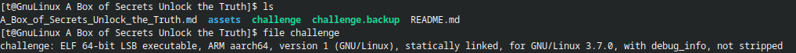

It is identified as a GNU/Linux ARM executable.
Then, I checked the strings inside the GNU/Linux ARM binary using:
```bash
strings challenge | less
```

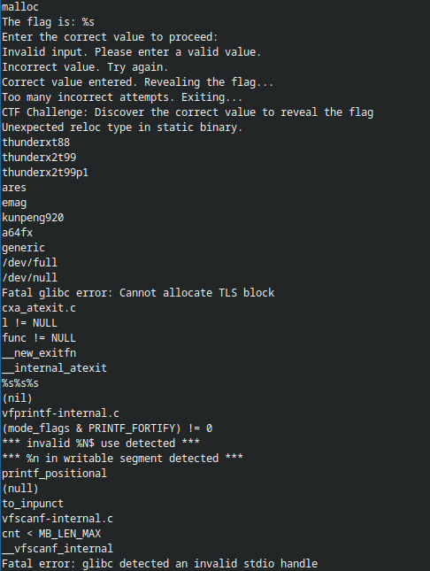

## Analysis and Debugging
I analyzed and patched the binary using `radare2`.
I used the `-w` flag to open the binary in write mode:
```bash
r2 -w challenge
```

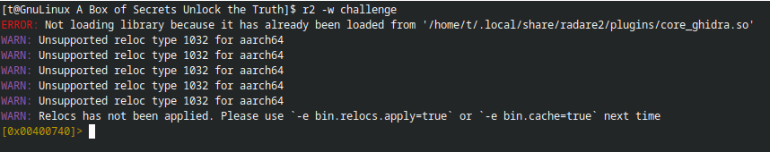

I analyzed and checked if there was a `main` function where the program starts:
```bash
aaaa
afl | grep main
```

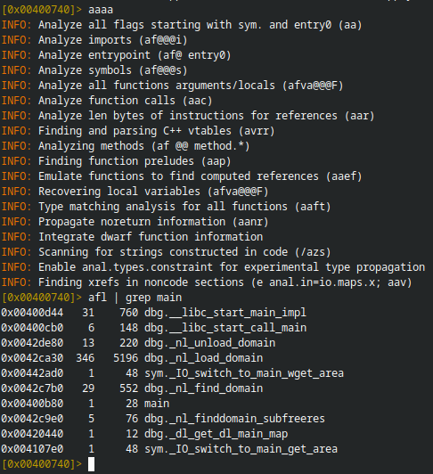

I moved to the `main` function and viewed the code using:
```bash
s main
pdd
pdf
```

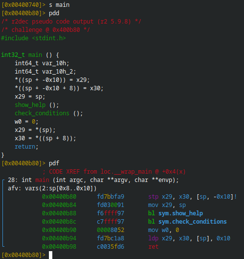

I found two function calls:

- `sym.show_help` – prints the help menu
- `sym.check_conditions` – checks conditions

I explored what the functions are doing:
```bash
s sym.show_help
pdd 
pdf 
s - 
s sym.check_conditions
pdd
pdf
```

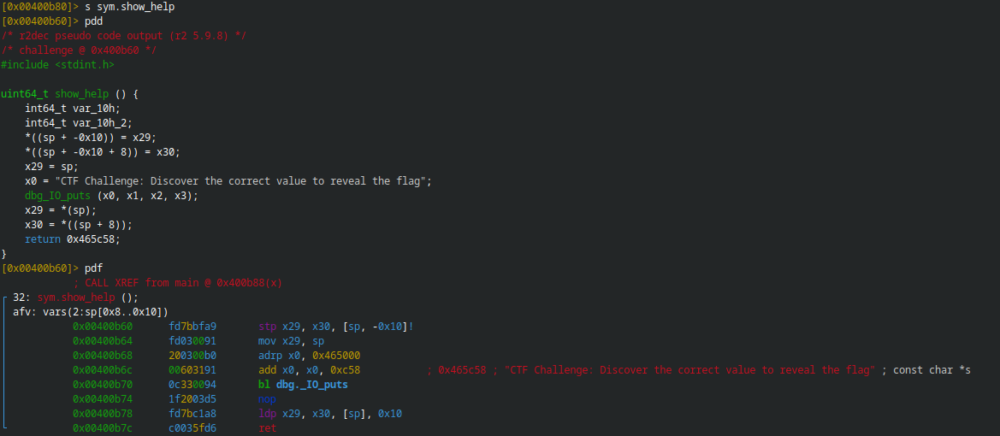

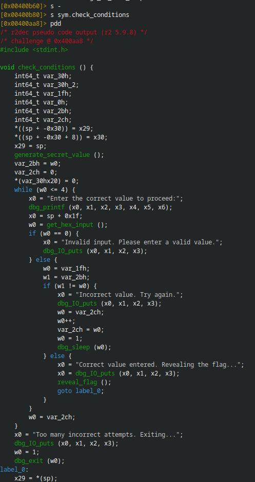

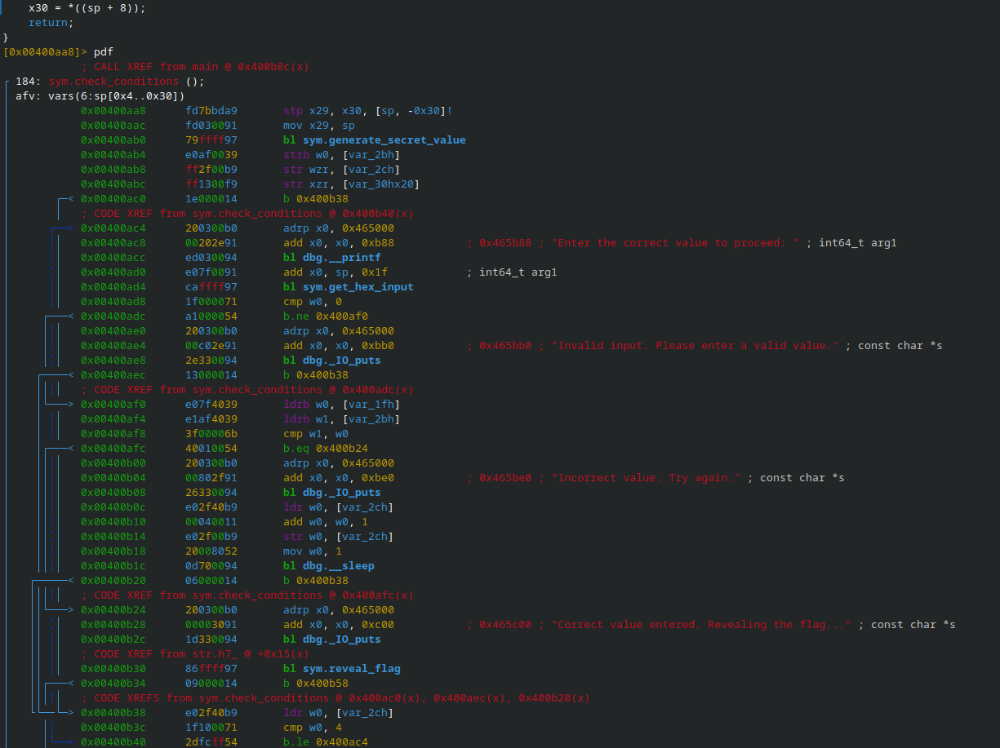

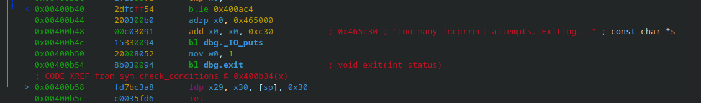

The first function just prints:
"CTF Challenge: Discover the correct value to reveal the flag"

The second function contains a while loop, if statements, and three functions:

- `generate_secret_value` – generates a random value using `time` and `getpid`.
- `get_hex_input` – gets input from the user and converts it to `hex`.
- `reveal_flag` – returns the flag.

I viewed the program flow:
```bash
VV
```

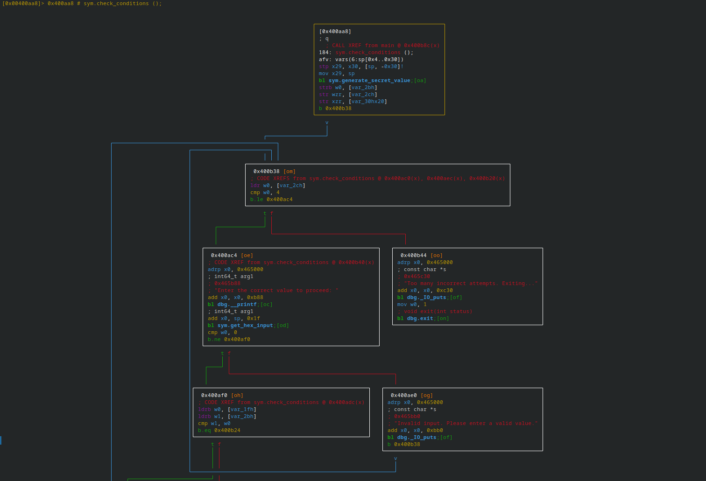

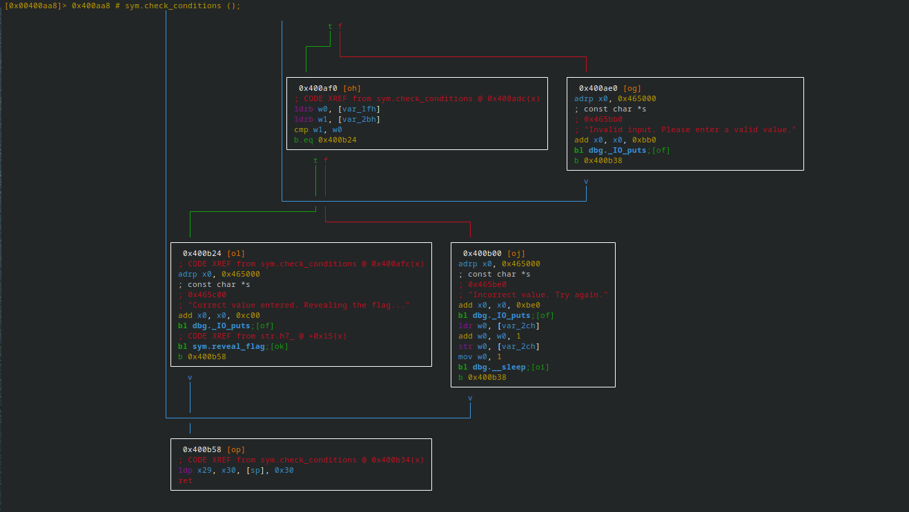

\begin{myanalysis}
As we can see in the box before the `reveal\_flag` function is called, there is a comparison between `w0` and `w1`:
\end{myanalysis}

```asm
cmp w1, w0
b.eq 0x400b24
```

\begin{myanalysis}
I noticed that `w0` is the input value, and it’s compared with `w1`, which is the random value.
So, if I change `w1` to `1` and compare it with `w0`, and input `1`, the comparison will be true, and the program will call `reveal\_flag` and output the flag.
\end{myanalysis}

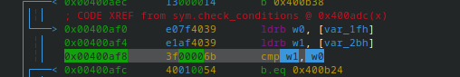

```asm
s 0x00400af8
wa cmp w0, 1
```

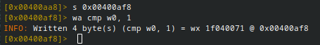

## Testing the Program

I ran the program using `qemu-aarch64`:
```bash
qemu-arrm64 ./challenge
1 

```
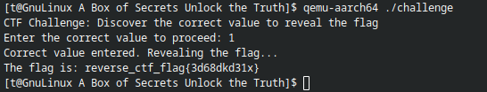

I got the flag:

```text
reverse_ctf_flag{3d68dkd31x}
```
