\newpage  
\tableofcontents  
\newpage

<!-- # Solution: Phantom Cipher -->
## Challenge Description
You’ve been handed a small Windows C program that hides a secret flag in memory, then prompts you for user input as a key to decrypt and reveal it. You’ll need a debugger to unchart that key.

Although the program will accept any five-letter string, it will only decrypt the flag if your input exactly matches the randomly generated key for its cipher.  

### Task Objective  
1. Run the binary using CMD to check the behaviour.
2. Load the binary in your debugger/decompier of choice.
3. Identify what and where the 5-character key is generated and stored.
4. Get the flag using the correct key combination.

### Delivery  
- Write a report that shows your steps to retrieve the flag, including tools, commands, and screenshots. 
- The exact flag you recovered.  # Phantom Cipher
You’ve been handed a small Windows C program that hides a secret flag in memory, then prompts you for user input as a key to decrypt and reveal it. You’ll need a debugger to unchart that key.

Although the program will accept any five-letter string, it will only decrypt the flag if your input exactly matches the randomly generated key for its cipher.  

## Tools and Environment
- Arch Linux (Host) - OS
- `Windows 10 (Guest)` - OS (via QEMU)
- `qemu-system-x86_64` Virtual Machine 
- `x64dbg` - Debugger.
- `file` - identifies file type. 
- `strings` - extracts printable strings from binaries.


## Data info

I checked the file type using the `file` command:
```bash 
file Phantom_Cipher.exe
```

<!-- First, I installed Windows on `disk.raw`, then installed `x64dbg`. -->  
<!-- After that, I moved the file `challgen` into the `qemu-share` directory and used the following command: -->

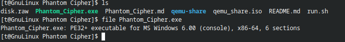

It is identified as a Windows executable.
Then, I checked the strings inside the Windows binary using:

```bash
strings Phantom_Cipher.exe | less

```

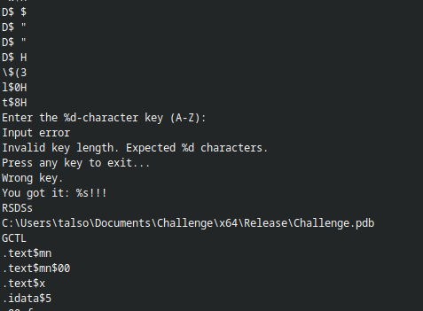

## Environment Setup
I used `qemu-system-x86_64` to run a Windows 10 virtual machine.  
The `disk.raw` file contains a pre-installed Windows 10 system.

```bash
qemu-system-x86_64 \
    -enable-kvm \
    -m 8G \
    -cpu host \
    -smp 4 \
    -machine type=q35,accel=kvm \
    -drive file=disk.raw,format=raw \
    -boot d \
    -net nic -net user \
    -device virtio-net,netdev=net0 \
    -netdev user,id=net0 \
    -usb -device usb-tablet \
    -display gtk
```

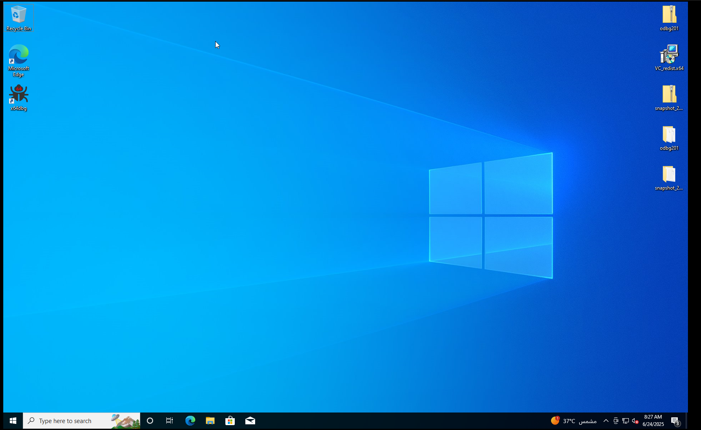

### Moving Data from Host (Arch Linux) to Guest (Windows 10)

#### Create ISO from Directory 
```bash
mkdir qemu_share
cp Phantom_Cipher.exe qemu_share
mkisofs -o qemu_share.iso qemu_share/
```

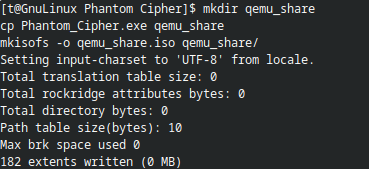

This copies the binary file to the `qemu_share` directory and creates an ISO image from it.

#### Mount the ISO in QEMU Guest 

```bash
CTRL ALT 2
info block
change ide2-cd0 qemu_share.iso
CTRL ALT 1
```

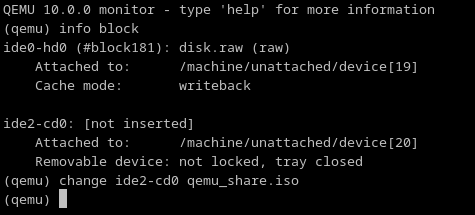

Once mounted, I was able to see the data inside the CD-ROM.
I then moved the file to the desktop.

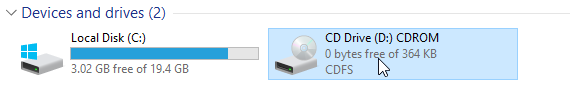

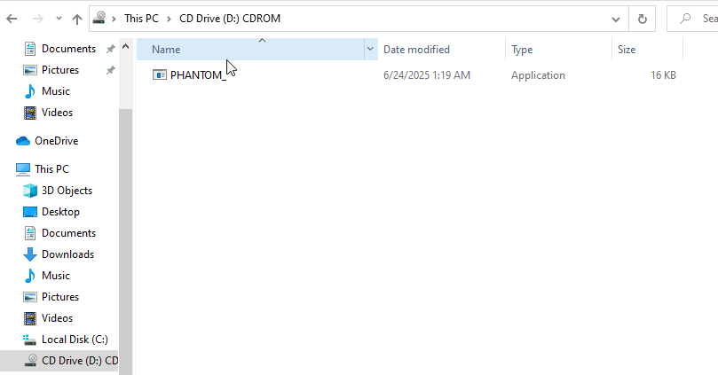

## Analysis and Debugging
I ran `x64dbg`.

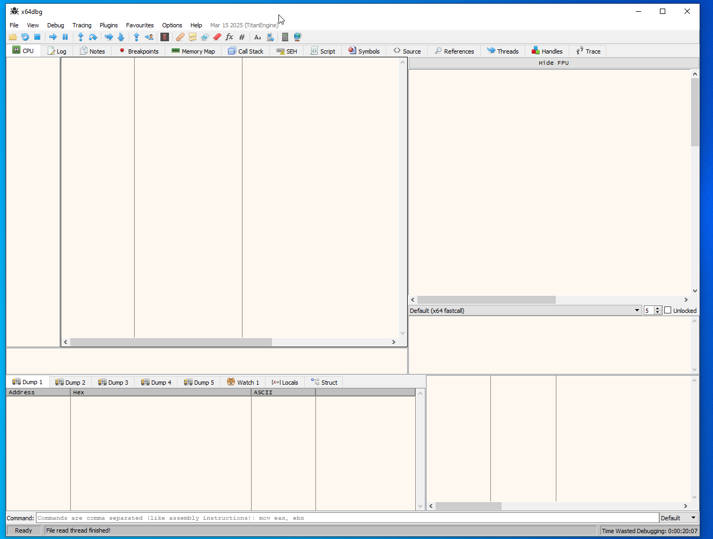

I dragged and dropped the binary file into `x64dbg`.

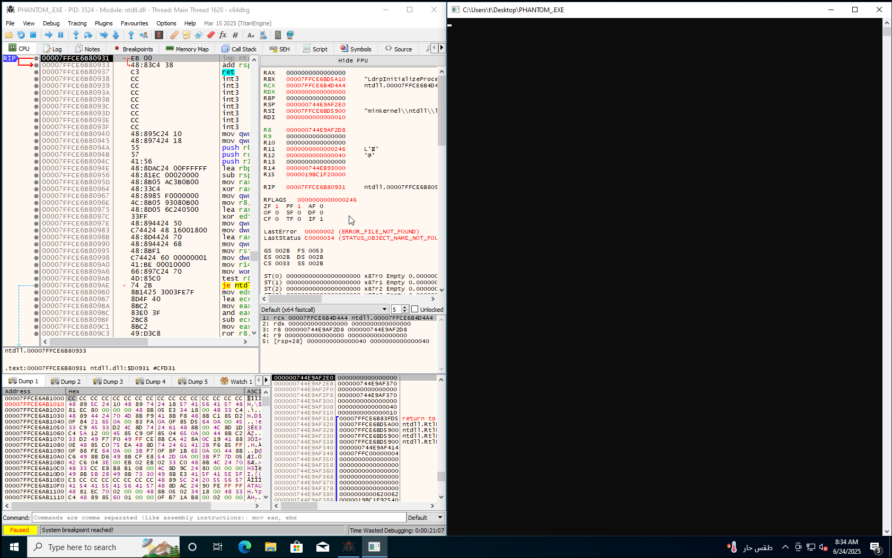

First, I ran the program to see what it would do.  
I entered 5 random characters and saw the message: `Wrong key.`


I mouse-right-clicked in `x64dbg`, then selected:  
-> `Search for` -> `All Modules` -> `String References`

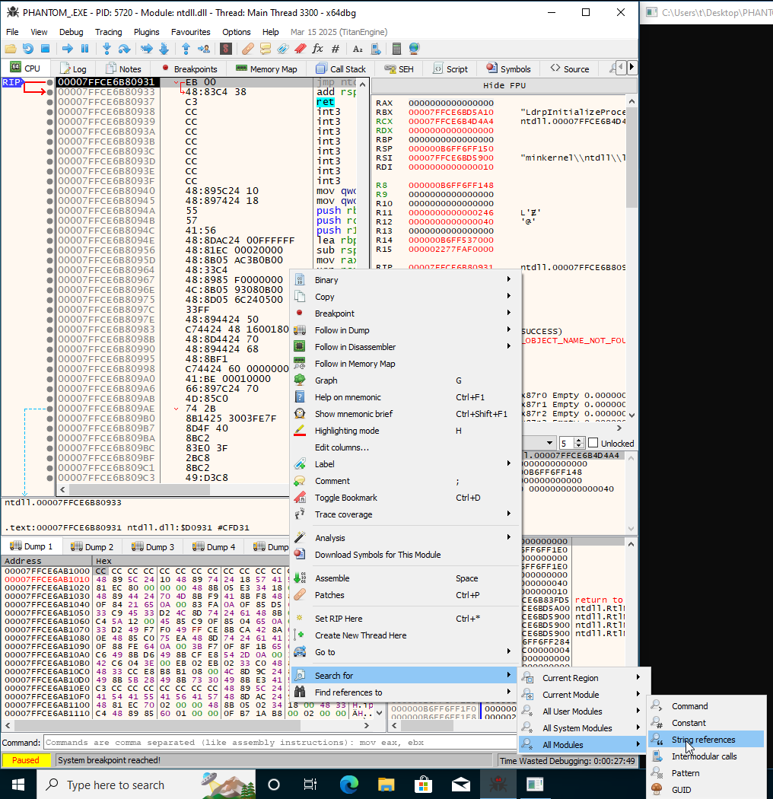

I mouse-right-clicked in `x64dbg`, then selected: `Search`

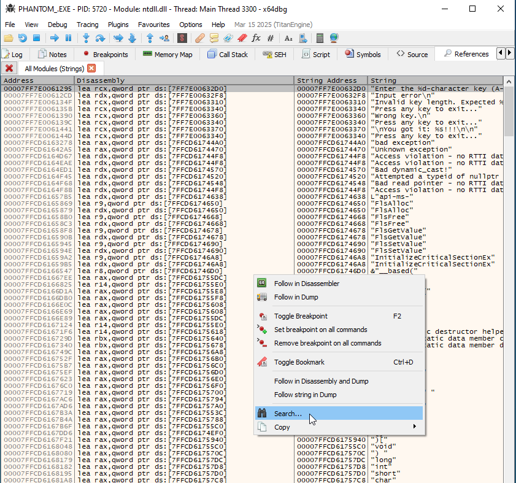

I entered "Wrong key."

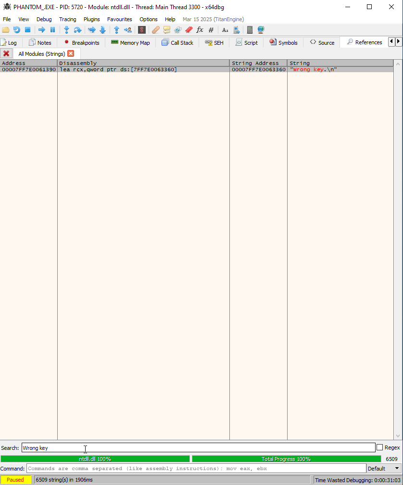

Then, I double-clicked on the "Wrong key." string.

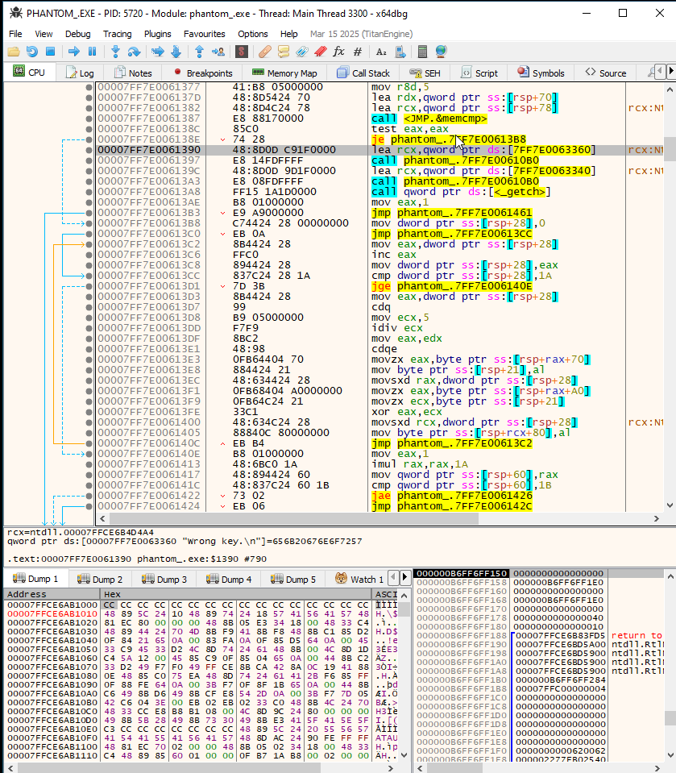


<!-- ::: note -->

\begin{myanalysis}
I saw the instruction `je` above the "Wrong key." string.
This instruction means "jump if equal".  
If the condition is true (equal), it will jump to print the flag.  
If not equal, it will not print the flag.
The opcode `74` means "jump if equal," and `75` means "jump if not equal."
I changed the opcode from `74` to `75`.
This change will cause it to jump and print the flag.
\end{myanalysis}

I mouse-left-clicked, hovered over the binary, then clicked `Edit`, changed the hex value from `74` to `75`, and clicked `OK`.

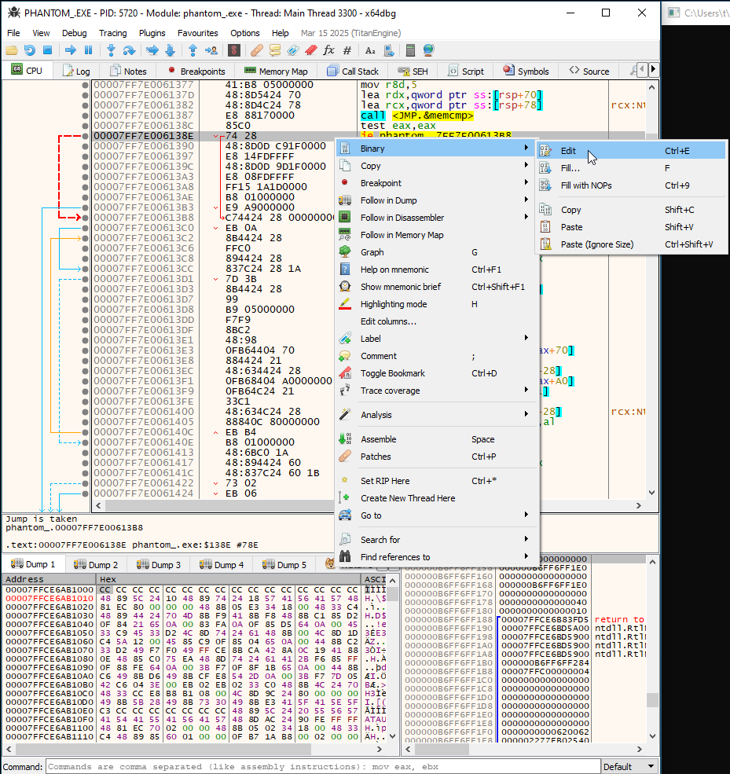

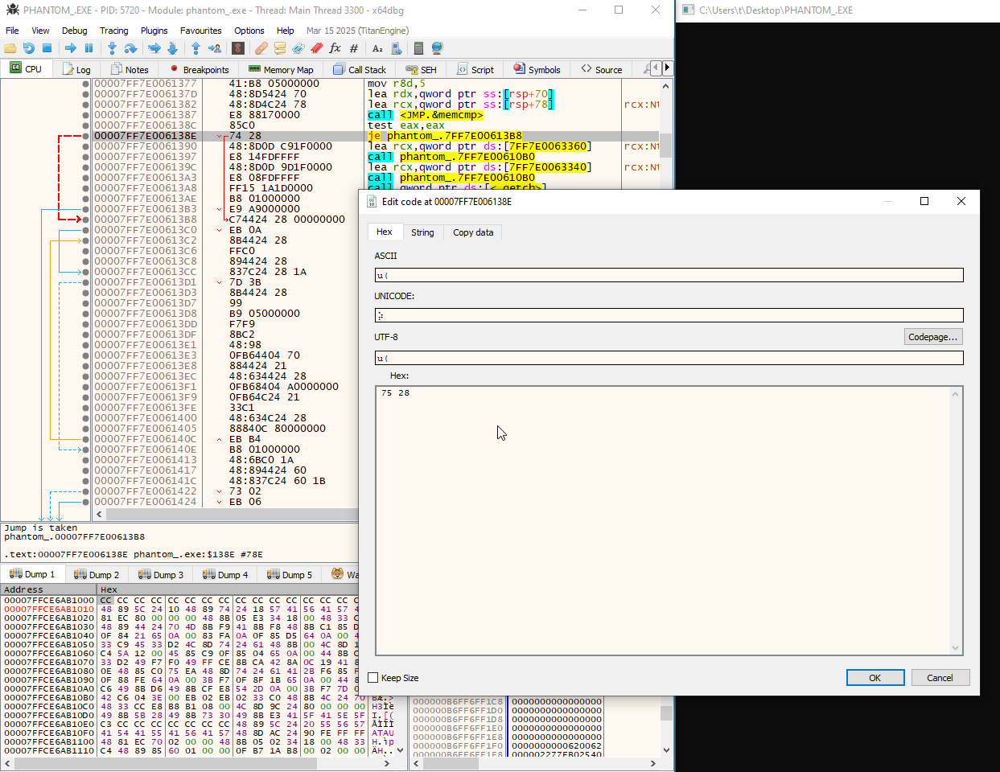

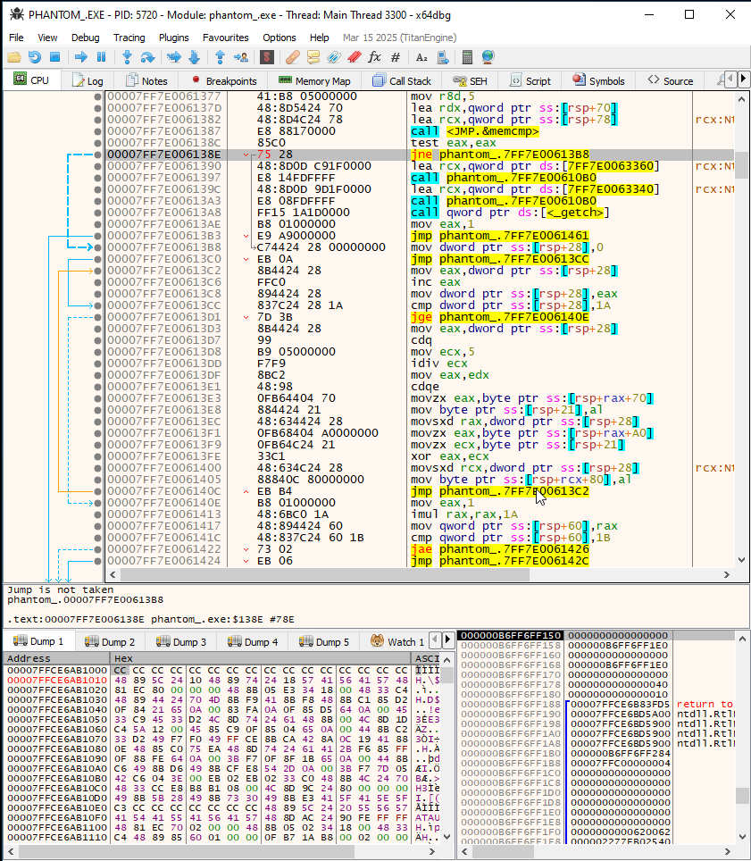


## Testing the Program

I ran the program again.

Then, I entered 5 random characters.

The flag appeared.

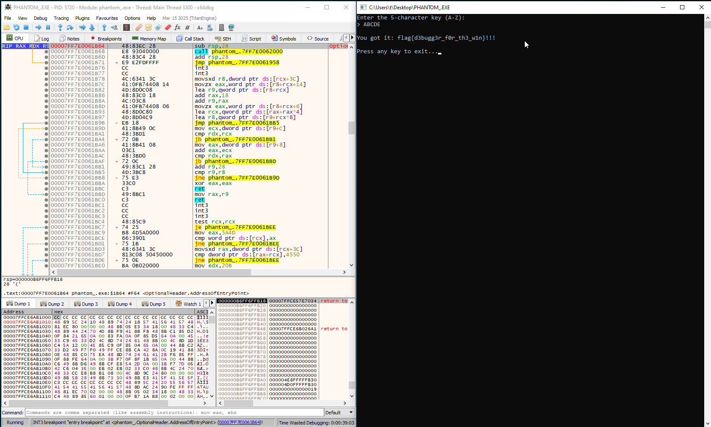


The flag is :
```text
flag{d3bugg3r_f0r_th3_w1n}
```


