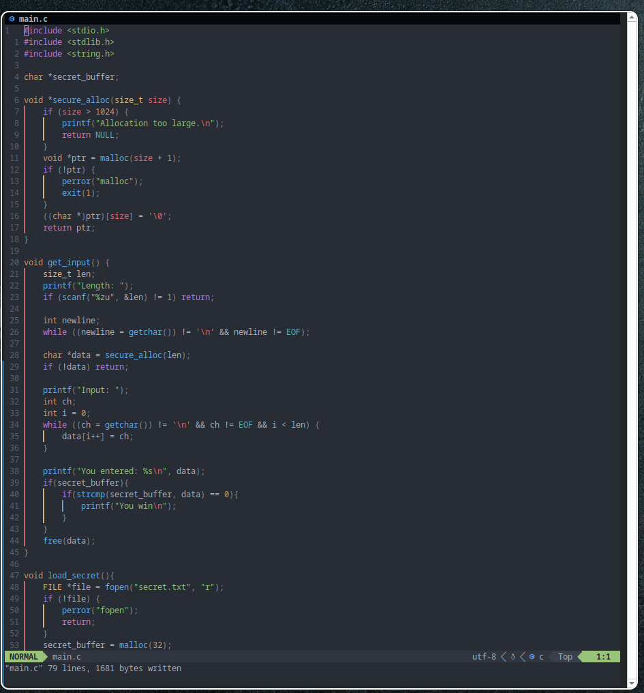
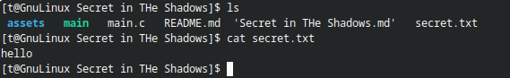
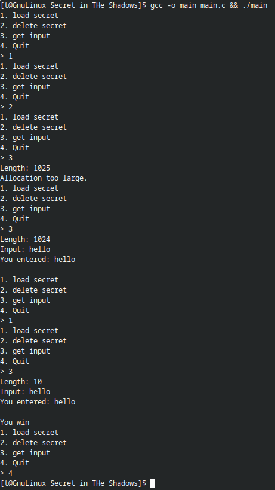
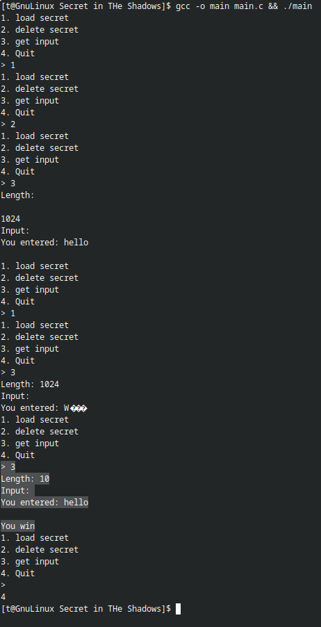
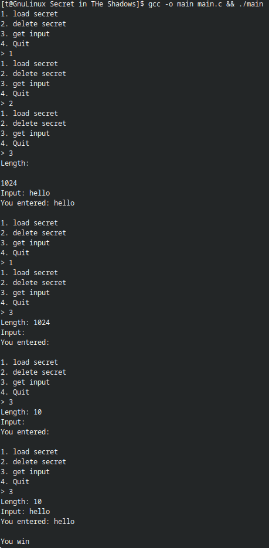

\newpage  
\tableofcontents  
\newpage

## Challenge Description
You’ve inherited a small C program that reads in a secret from a file and allows users to input data in an attempt to match it. If the user input matches the secret, the program prints a celebratory message. Sounds simple... maybe too simple.

Although the program appears to work under normal conditions, there's a subtle bug lurking in the shadows—one that could cause it to behave unpredictably, even dangerously. 


## Tasks Objective
Your mission is to analyze the code and identify the most critical issue affecting its security.

## Delivery
Write a report detailing your findings, also highlight the work performed and the methods used.

## The Code 

```c
#include <stdio.h>
#include <stdlib.h>
#include <string.h>

char *secret_buffer;

void *secure_alloc(size_t size) {
    if (size > 1024) {                    
        printf("Allocation too large.\n");
        return NULL;
    }
    void *ptr = malloc(size + 1);
    if (!ptr) {
        perror("malloc");
        exit(1);
    }
    ((char *)ptr)[size] = '\0';
    return ptr;
}

void get_input() {
    size_t len;
    printf("Length: ");
    if (scanf("%zu", &len) != 1) return; 

    int newline;
    while ((newline = getchar()) != '\n' && newline != EOF);

    char *data = secure_alloc(len);
    if (!data) return;

    printf("Input: ");
    int ch;
    int i = 0;
    while ((ch = getchar()) != '\n' && ch != EOF && i < len) {  
    	data[i++] = ch;
    }

    printf("You entered: %s\n", data);
    if(secret_buffer){
        if(strcmp(secret_buffer, data) == 0){
            printf("You win\n");
        }
    }
    free(data);
}

void load_secret(){
    FILE *file = fopen("secret.txt", "r");
    if (!file) {
        perror("fopen");
        return;
    }
    secret_buffer = malloc(32);
    fgets(secret_buffer, 32, file);
    fclose(file);
}

void unload_secret(){
    if(secret_buffer){
        free(secret_buffer);
        secret_buffer = NULL; 
    }
}

int main() {
    int choice;
    while(1) {
        printf("1. load secret\n2. delete secret\n3. get input\n4. Quit\n> ");
        if (scanf("%d", &choice) != 1) break;
            switch (choice) {
                case 1: load_secret(); break;
                case 2: unload_secret(); break;
                case 3: get_input(); break;
                default: return 0;
            }
        }
    return 0;
}

```

## Tools and Environment
- Arch Linux (Host)
- Neovim (editor)
- GCC (compiler)

## Analyze and testing
The first thing I did was copy the snippet of code, paste it into Neovim, and save it as `main.c`.



I read the code carefully.

There are 4 functions:

- `secure_alloc` type `void*` 
    - create alocte less then 1025 bytes memory space by your choice 
    - last byte is `\0`
    - returns pointer of the alloction memory.

- `get_input` — returns `void`
  - Takes input (`length` and characters) from the user.
  - Calls `secure_alloc` and uses the user-provided length to allocate memory for the characters.
  - Uses `getchar` to read characters and stores them in the allocated memory.
  - Prints `secret_buffer` if the input matches `secret_buffer`.

- `load_secret` — returns `void`
  - Reads the file `secret.txt` and stores its content in `secret_buffer` (size: 32 bytes).

- `unload_secret` — returns `void`
  - If `secret_buffer` exists, frees it using `free` and sets it to `NULL`.

- `main` — returns `void`
  - Takes an input number using `scanf` and calls one of the functions (`load_secret`, `unload_secret`, or `get_input`) depending on the number using a `switch` statement.

\begin{myanalysis}
The code seems to work fine if the user enters normal input, but if the user provides unexpected input, the program may not behave correctly due to the use of \texttt{getchar}.
\end{myanalysis}

Let's test it.


```bash
gcc -o main main.c && ./main
1 
2 
3
1025
3
1024 
hello
1 
3 
10 
hello
4
```


\begin{myanalysis}
It seems to work fine.  
But what if we input empty characters — what will happen?
\end{myanalysis}





\begin{myanalysis}
As we can see, it returns the \texttt{secret\_buffer} data even when we do not enter anything. This is because the \texttt{getchar} function reads from the buffer instead of standard input. Therefore, we should change the code to fix this vulnerability.
\end{myanalysis}

Vulnerable code:
```c
     while ((ch = getchar()) != '\n' && ch != EOF && i < len) {  
     	data[i++] = ch;
     }
```

We should replace `getchar` with `fgets` to read properly from standard input (`stdin`).
```c
    fgets(data, len, stdin);
```

This is the output after replacing `getchar` with `fgets`.


The vulnerability has been fixed.

## The updated code
Here is the updated code:
```c
#include <stdio.h>
#include <stdlib.h>
#include <string.h>

char *secret_buffer;

void *secure_alloc(size_t size) {
    if (size > 1024) {                    
        printf("Allocation too large.\n");
        return NULL;
    }
    void *ptr = malloc(size + 1);
    if (!ptr) {
        perror("malloc");
        exit(1);
    }
    ((char *)ptr)[size] = '\0';
    return ptr;
}

void get_input() {
    size_t len;
    printf("Length: ");
    if (scanf("%zu", &len) != 1) return; 

    int newline;
    while ((newline = getchar()) != '\n' && newline != EOF);

    char *data = secure_alloc(len);
    if (!data) return;

    printf("Input: ");
    int ch;
    int i = 0;

    fgets(data, len, stdin);

    printf("You entered: %s\n", data);
    if(secret_buffer){
        if(strcmp(secret_buffer, data) == 0){
            printf("You win\n");
        }
    }
    free(data);
}

void load_secret(){
    FILE *file = fopen("secret.txt", "r");
    if (!file) {
        perror("fopen");
        return;
    }
    secret_buffer = malloc(32);
    fgets(secret_buffer, 32, file);
    fclose(file);
}

void unload_secret(){
    if(secret_buffer){
        free(secret_buffer);
        secret_buffer = NULL; 
    }
}

int main() {
    int choice;
    while(1) {
        printf("1. load secret\n2. delete secret\n3. get input\n4. Quit\n> ");
        if (scanf("%d", &choice) != 1) break;
            switch (choice) {
                case 1: load_secret(); break;
                case 2: unload_secret(); break;
                case 3: get_input(); break;
                default: return 0;
            }
        }
    return 0;
}
```

